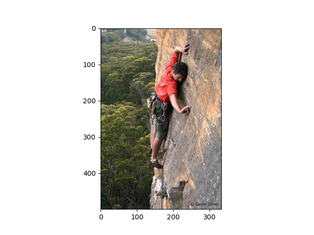
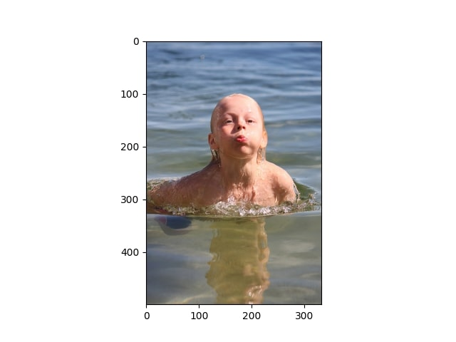
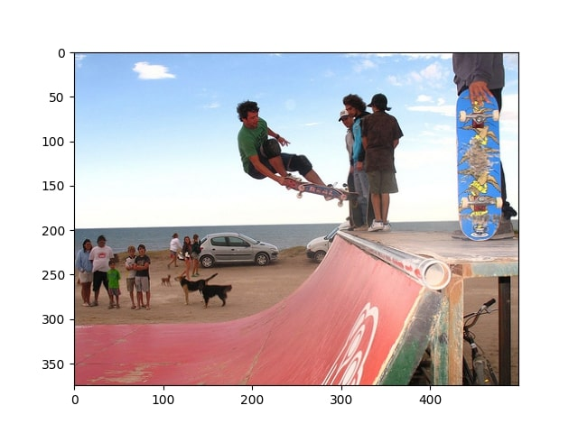

# Image-Captioning-with-Transformers

# Image Captioning with MaxVit Encoder and Transformers Decoder


Welcome to the Image Captioning project, a powerful image captioning model using MaxVit as the encoder and Transformers as the decoder. This repository provides all the necessary code and resources to create an advanced image captioning system that generates descriptive captions for images.

## Overview

- **MaxVit Encoder**: We leverage the MaxVit (Vision Transformer) model from the TIMM (PyTorch Image Models) library as the encoder. It is pre-trained on the ImageNet dataset and serves as a robust feature extractor for image understanding.

- **Transformers Decoder**: For natural language caption generation, we employ a Transformers-based decoder. This architecture excels at sequential data generation tasks and ensures the generated captions are fluent and contextually accurate.

- **Training**: The core components of the model are defined in the `model.py` file. The `train.py` script is responsible for training the model using image-caption pairs. The `get_loader.py` script handles data loading and preprocessing, making it easy to adapt the model to different datasets.

- **High-Quality Results**: We have fine-tuned the model to produce impressive results in generating captions for various types of images. These results showcase the effectiveness of MaxVit as an encoder and the Transformers decoder in providing meaningful and coherent image descriptions.

## Usage

1. **Clone the Repository**: Clone this repository to your local machine using the following command:

    ```bash
    git clone https://github.com/your-username/image-captioning.git
    ```

2. **Install Dependencies**: Make sure you have all the required dependencies installed. You can install them using `pip`:

    ```bash
    pip install -r requirements.txt
    ```

3. **Data Preparation**: Prepare your image-caption dataset and adjust the data loading process in `get_loader.py` accordingly.

4. **Training**: Train the model using your dataset by running the `train.py` script:

    ```bash
    python train.py
    ```

5. **Inference**: After training, you can use the model to generate captions for new images.

## Results

Here are some examples of image captions generated by our model:

<div align="center">
  
      <em>Caption 1: "a man climbs a rock face."</em>
  
    <em>Caption 3: "a young boy swimming in the water"</em>
</div>

<div align="center">
  
     <em>Caption 2: "a man doing a trick on a skateboard"</em>
</div>
 


## Feedback and Contributions

We welcome your feedback, suggestions, and contributions to improve this project. If you have any questions or ideas, please feel free to open an issue or submit a pull request.


## Acknowledgments

- We thank the authors of MaxVit and Transformers , timm Lib for their incredible work and contributions to the deep learning community.

## About the Author

This project is maintained by [Manav Barot](https://github.com/themnvrao76). Feel free to reach out for any inquiries or collaborations.
We have incorporated certain utility functions from [source repository/link](https://www.youtube.com/watch?v=y2BaTt1fxJU&ab_channel=AladdinPersson)https://www.youtube.com/watch?v=y2BaTt1fxJU&ab_channel=AladdinPersson]
Happy image captioning! 📷📝
